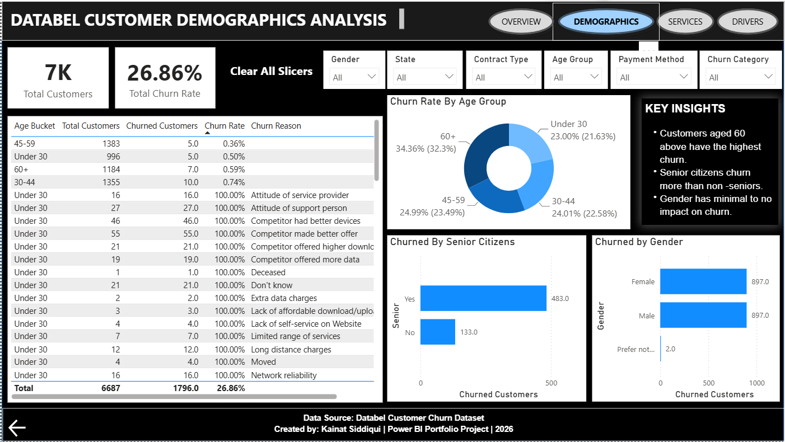
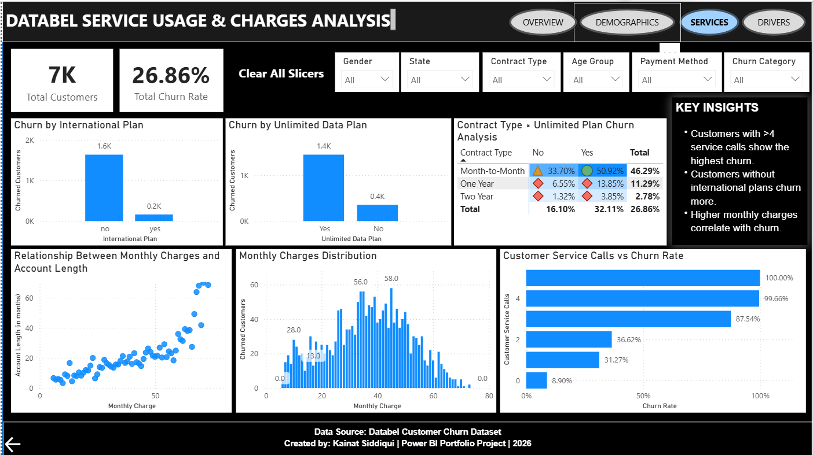
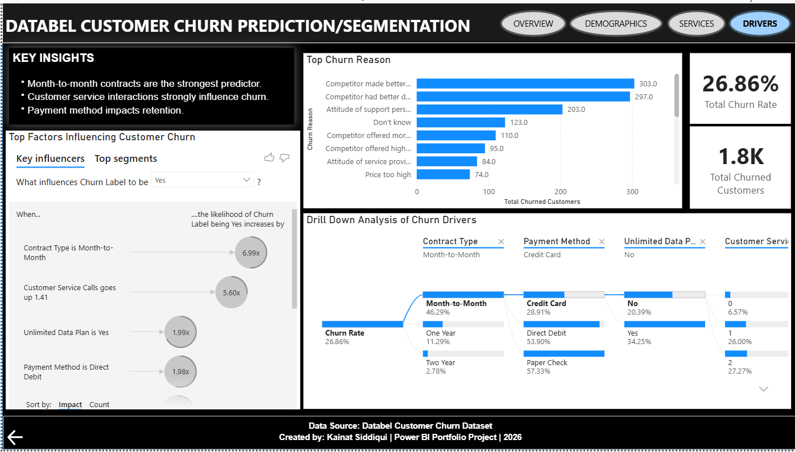

# databel-customer-churn-analysis-powerbi

**Databel Customer Churn Analysis Dashboard | Power BI**

**Project Overview**

This project analyzes customer churn behavior in a telecom company using Power BI. The objective is to identify customer segments with high churn probability and uncover key factors influencing customer attrition.

**Business Problem**

Customer churn significantly impacts revenue and customer acquisition costs. This dashboard helps answer:
- Which customers are most likely to churn?
- Which customer segments have the highest churn?
- How do service usage patterns affect churn?
- What are the primary reasons for customer attrition?
  
**Tools Used**
- Power BI
- DAX
- Data Modeling
- Drill Through
- Key Influencers
- Decomposition Tree
- Interactive Filters
  
**Dashboard Features**

**Executive Overview**
- KPI Cards
- Contract Type Analysis
- Payment Method Analysis
- State-wise Churn Analysis
  
**Customer Demographics**
- Age Group Analysis
- Gender Analysis
- Senior Citizen Analysis
  
**Service Usage & Charges**
- Service Calls Analysis
- Monthly Charges Analysis
- International Plan Analysis
- Unlimited Data Analysis
  
**Churn Drivers**
- Key Influencers Visual
- Decomposition Tree
- Churn Reasons Analysis

**Key Insights**
- 74% of customers were retained.
- Month-to-month contracts account for 89% of churn.
- Senior citizens have the highest churn rate.
- Customers with more than 4 service calls show significantly higher churn.
- Contract type is the strongest predictor of churn.
  
**Dashboard Screenshots**

<h2>Dashboard 1: Executive Overview</h2>

<h2>Dashboard 2: Customer Demographics</h2>

<h2>Dashboard 3: Service Usage & Charges</h2>

<h2>Dashboard 4: Churn Drivers & Segmentation</h2>

<h2>Drill Through: Customer Details</h2>

**THANK YOU**!
