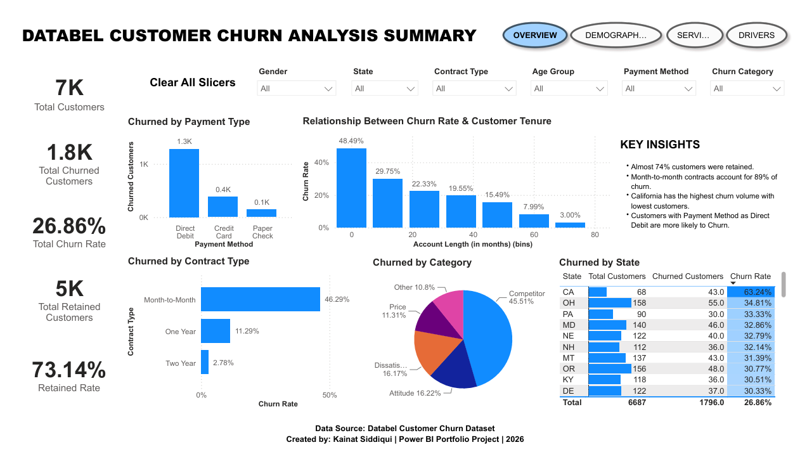
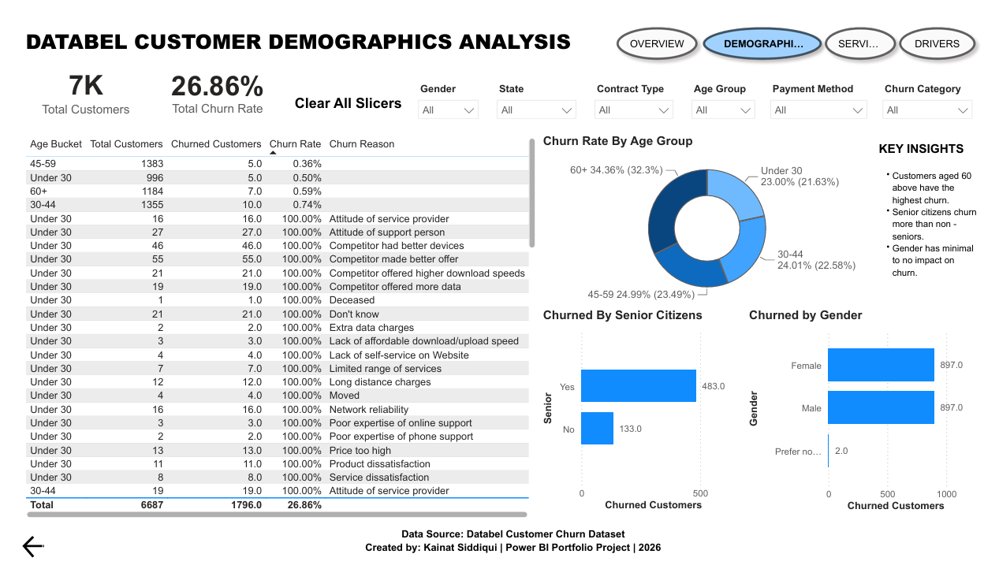
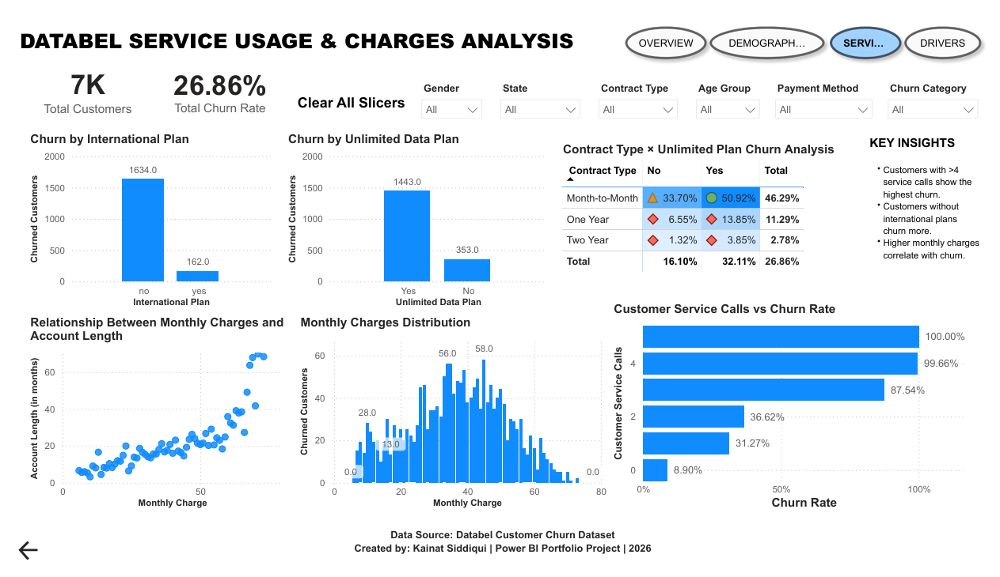
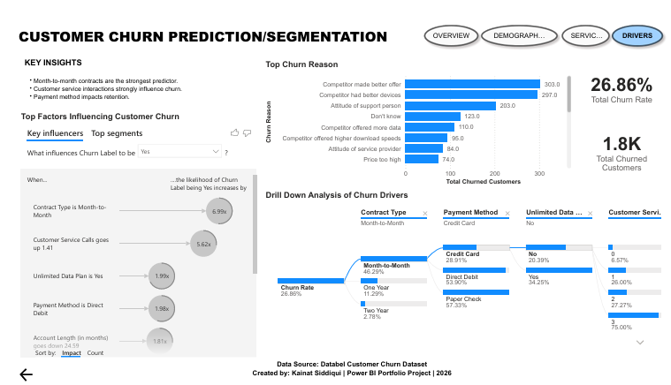

## Databel Customer Churn Analysis Dashboard | Power BI

### Project Overview

This project analyzes customer churn behavior in a telecom company using Power BI. The objective is to identify customer segments with high churn probability and uncover key factors influencing customer attrition.

---

### 📷 Dashboard Preview

<h2>Dashboard 1: Executive Overview</h2>

<h2>Dashboard 2: Customer Demographics</h2>

<h2>Dashboard 3: Service Usage & Charges</h2>

<h2>Dashboard 4: Churn Drivers & Segmentation</h2>

---

### Business Problem

Customer churn significantly impacts revenue and customer acquisition costs. This dashboard helps answer:
- Which customers are most likely to churn?
- Which customer segments have the highest churn?
- How do service usage patterns affect churn?
- What are the primary reasons for customer attrition?

---

### Dataset Overview

- Industry: Telecommunications
- Dataset Type: Customer Churn Analysis
- Total Customers: 6,687
- Target Variable: Churn Label

---

### Tools Used
- Power BI
- DAX
- Data Modeling
- Drill Through
- Key Influencers
- Decomposition Tree
- Interactive Filters

---

### Dashboard Features

**Executive Overview**
- KPI Cards
- Contract Type Analysis
- Payment Method Analysis
- State-wise Churn Analysis
  
**Customer Demographics**
- Age Group Analysis
- Gender Analysis
- Senior Citizen Analysis
  
**Service Usage & Charges**
- Service Calls Analysis
- Monthly Charges Analysis
- International Plan Analysis
- Unlimited Data Analysis
  
**Churn Drivers**
- Key Influencers Visual
- Decomposition Tree
- Churn Reasons Analysis

**Interactive Features**

- Drill-through page accessible from Contract Type, Age Group, and Customer Service Calls visuals.
- Synchronized slicers across all dashboard pages.
- Navigation buttons for seamless dashboard transitions.
- Clear-all slicers functionality.
- Interactive tooltips for enhanced data exploration.

---

### Key Insights
- 74% of customers were retained.
- Month-to-month contracts account for 89% of churn.
- Senior citizens have the highest churn rate.
- Customers with more than 4 service calls show significantly higher churn.
- Contract type is the strongest predictor of churn.

---

### Business Recommendations

Based on the analysis, the following actions are recommended:

- Encourage customers to switch from month-to-month contracts to yearly contracts through loyalty discounts and promotional offers.
- Improve customer support experience, as customers with multiple service calls exhibit significantly higher churn.
- Implement targeted retention campaigns for high-risk customer segments identified through churn analysis.
- Offer personalized plans and incentives to senior customers to improve retention.
- Monitor customers with high monthly charges and proactively engage them through customer success programs.

---

### Technical Skills Demonstrated

- Power BI Dashboard Development
- Data Cleaning
- Data Modeling
- DAX Measures
- KPI Design
- Drill Through
- Decomposition Tree
- Key Influencers
- Data Storytelling
- Business Intelligence
  
---

## 👨‍💻 Author
**Kainat Siddiqui**
